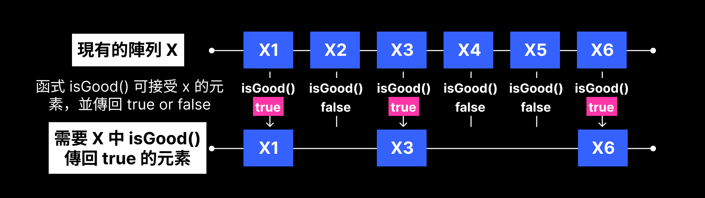
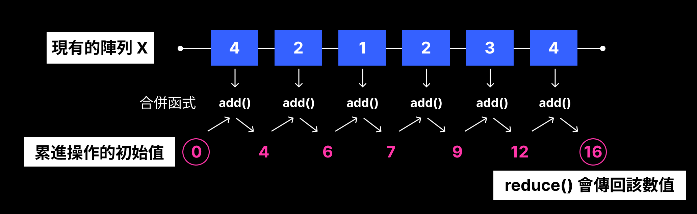

---
# You can also start simply with 'default'
theme: default
# background: https://cover.sli.dev
# some information about your slides (markdown enabled)
title: 用 Functional Programming 重構程式
info: |
  ## Functional Programming 
  測試內部資料更新
# apply unocss classes to the current slide
class: text-center
# https://sli.dev/features/drawing
drawings:
  persist: true
# slide transition: https://sli.dev/guide/animations.html#slide-transitions
transition: fade
# enable MDC Syntax: https://sli.dev/features/mdc
mdc: true
---

# Functional Programming

第12章 利用函式走訪 <br/>
第13章 串連函數式工具 <br/><br/>
( presentation by Laura )

<style>

h1 {
  font-weight: bold;
  letter-spacing: 1.05px;
  font-size: 2.25rem !important;
  margin-bottom: 0.5rem;
}
.dark h1 {
  color: #fff !important;
}
.light h1 {
  color:rgb(0, 0, 0);
}

.slidev-layout h1 + p {
  opacity: 0.75;
}
.slidev-layout a.slidev-icon-btn:hover {
  color: #000;
}
.slidev-layout a:hover {
  padding: 0.5rem;
}
</style>


--- 
transition: fade
layout: two-cols
layoutClass: gap-16
---

## 大綱

::right::

<Toc text-sm minDepth="1" maxDepth="2" />

<style>
a div p {
  font-size: 1.25rem !important;
}
</style>

---
transition: fade
layout: two-cols
layoutClass: gap-4
---

## review

<strong> 重構 1：將隱性引數轉換成顯性 </strong>
<ul>
  <li>1. 辨識出函式名稱裡的隱性引數</li>
  <li>2. 加入新參數以接受顯性輸入</li>
  <li>3. 利用新參數取代函式實作中的固定值</li>
  <li>4. 更改呼叫程式碼</li>
</ul>
<br/>

```js{all}{lines: true}
function setPriceByName(cart, name, price) {
  const item = cart[name];
  const newItem = objectSet(item, 'price', price);
  const newCart = objectSet(cart, name, newItem);
  return newCart;
}

cart = setPriceByName(cart, 'shoes', 13);
cart = setQuantityByName(cart, 'shoes', 3);
cart = setShippingByName(cart, 'shoes', 0);
cart = setTaxByName(cart, 'shoes', 2.34);
```

::right::
<div class='no-show'></div>

<v-clicks>

```js{all}{lines: true}
function setFieldByName(cart, name, field, value) {
  const item = cart[name];
  const newItem = objectSet(item, field, value);
  const newCart = objectSet(cart, name, newItem);
  return newCart;
}

cart = setFieldByName(cart, 'shoes', 'price', 13);
cart = setFieldByName(cart, 'shoes', 'quantity', 3);
cart = setFieldByName(cart, 'shoes', 'shipping', 0);
cart = setFieldByName(cart, 'shoes', 'tax', 2.34);
```

</v-clicks>

<div class='page'>
  {{ $page }}
</div>

<style>
li {
  font-size: 1.025rem;
  letter-spacing: 0.85px;
}
.light strong {
  color: #fff !important;
  padding: 0 0.5rem !important;
  letter-spacing: 0.5px;
  background-color: #000;
}
strong {
  color: #000 !important;
  padding: 0 0.5rem !important;
  letter-spacing: 0.5px;
  background-color: #fff;
  border-radius: 3px;
}
.no-show {
  height: 235px;
}
</style>

<!--
第一個函式裡的實作裡有某個引數，且該引數出現於函式的名稱上，

作者覺得這個函式有程式碼異味，需要重構。

這裡的 price 就是隱性引數，

我們在重構後的函式中加入顯性引數 field ，並將可能的隱性引數值轉換為頭等物件，

再以顯性方式傳入。

-->

---
transition: fade
---

### review

<strong> 重構 2：以回呼取代主體實作 </strong>
<ul>
  <li class="red-text">1. 辨識一段程式的前段、主體與後段區塊</li>
  <li>2. 將所有區塊包裝成函式 a</li>
  <li>3. 將主體區塊擷取成函式 b，並將其當成引數傳入函式 a</li>
</ul>
<br/>
```js{all}{lines: true}
try {
  saveUserData(user);
} catch (error) {
  logToSnapErrors(error);
}
```
<br/>

```js{all}{lines: true}
try {
  fetchProduct(productId);
} catch (error) {
  logToSnapErrors(error);
}
```

<div class='page'>
  {{ $page }}
</div>

<style>
li {
  font-size: 1.025rem;
  letter-spacing: 0.85px;
}
.light strong {
  color: #fff !important;
  padding: 0 0.5rem !important;
  letter-spacing: 0.5px;
  background-color: #000;
}
a div p {
  font-size: 1.25rem !important;
}
strong {
  color: #000 !important;
  padding: 0 0.5rem !important;
  letter-spacing: 0.5px;
  background-color: #fff;
  border-radius: 3px;
}
</style>

<!--
先拆分 前段、主體、後段，前段與後段不會改變

try 為前段，function 為主體，catch 為後段
-->

---
transition: fade
---
### review

<strong> 重構 2：以回呼取代主體實作 </strong>
<ul>
  <li>1. 辨識一段程式的前段、主體與後段區塊</li>
  <li class="red-text">2. 將所有區塊包裝成函式 a</li>
  <li>3. 將主體區塊擷取成函式 b，並將其當成引數傳入函式 a</li>
</ul>
<br/>

```js
function withLogging() {
  try {
    saveUserData(user);
  } catch (error) {
    logToSnapErrors(error);
  }
}

withLogging()
```

<div class='page'>
  {{ $page }}
</div>

<style>
li {
  font-size: 1.025rem;
  letter-spacing: 0.85px;
}
.light strong {
  color: #fff !important;
  padding: 0 0.5rem !important;
  letter-spacing: 0.5px;
  background-color: #000;
}
a div p {
  font-size: 1.25rem !important;
}
strong {
  color: #000 !important;
  padding: 0 0.5rem !important;
  letter-spacing: 0.5px;
  background-color: #fff;
  border-radius: 3px;
}

</style>

<!--
把整段程式包裝到新函式中，命名為 withLogging
-->

---
transition: fade
---
### review

<strong> 重構 2：以回呼取代主體實作 </strong>
<ul>
  <li>1. 辨識一段程式的前段、主體與後段區塊</li>
  <li>2. 將所有區塊包裝成函式 a</li>
  <li class="red-text">3. 將主體區塊擷取成函式 b，並將其當成引數傳入函式 a</li>
</ul>
<br/>

```js
function withLogging(f) { // f ＝ 要傳入的函式
  try {
    f(); // 在原本主體位置呼叫回呼函式
  } catch (error) {
    logToSnapErrors(error);
  }
}

withLogging(function() { // 傳入主體程式碼
  saveUserData(user);
})
```

<div class='page'>
  {{ $page }}
</div>

<style>
li {
  font-size: 1.025rem;
  letter-spacing: 0.85px;
}
.light strong {
  color: #fff !important;
  padding: 0 0.5rem !important;
  letter-spacing: 0.5px;
  background-color: #000;
}
a div p {
  font-size: 1.25rem !important;
}
strong {
  color: #000 !important;
  padding: 0 0.5rem !important;
  letter-spacing: 0.5px;
  background-color: #fff;
  border-radius: 3px;
}
.no-show {
  height: 210px;
}
</style>

<!--
再來是擷取主體區塊成回呼，

把它當成參數傳入 withLogging()。

「回呼函數」（callback function）其實就是 

你把一個函數當作參數傳給另一個函數，

然後那個函數在合適的時候「呼叫」它。
-->

---
transition: fade
layout: two-cols
layoutClass: gap-4
mdc: true
---

## 三大函數式工具 - map ()
🎯 問題：重複的「遍歷 + [轉換元素]{style="color:yellow;font-weight: bold"} + 建立新陣列」

```js {all}{lines: true}
function emailForCustomers(customers, goods, bests) {
  const emails = [];
  for(let i = 0; i < customers.length; i++) {
    const customer = customers[i];
    const email = emailForCustomer(customer, goods, bests);
    emails.push(email);
  }
  return emails;
}
```

```js {all}{lines: true}
function emailFullNames(customers) {
  const fullNames = [];
  for(let i = 0; i < customers.length; i++) {
    const customer = customers[i];
    const name = customer.firstName + ` ` + customer.lastName;
    fullNames.push(name);
  }
  return fullNames;
}
```

::right::

<div class="no-show"></div>

```js {all}{lines: true}
function biggestPurchasePerCustomer(customers) {
  const purchases = [];
  for(let i = 0; i < customers.length; i++) {
    const customer = customers[i];
    const purchase = biggestPurchase(customer); 
    purchases.push(purchase);
  }
  return purchases;
}
```

```js {all}{lines: true}
function customerCities(customers) {
  const cities = [];
  for(let i = 0; i < customers.length; i++) {
    const customer = customers[i];
    const city = customer.address.city;
    cities.push(city);
  }
  return cities;
}
```

<div class='page'>
  {{ $page }}
</div>

<style>
.footnotes-sep {
  @apply mt-5 opacity-10;
}
.footnotes {
  @apply text-sm opacity-75;
}
.footnote-backref {
  display: none;
}
.no-show {
  height: 90px;
}
</style>

<!--
接下來會開始介紹 第12章 利用函式走訪， 

map, filter, reduce 這三個函式工具，

但是在這本書裡作者將這三者作為自定義函式，

而不是作為 js 內建的方法使用。

現在這個範例為他們想要建立新的電子郵件系統，要寄送優惠碼 email，
-->

---
transition: fade
layout: two-cols
layoutClass: gap-4
---

### 1. 辨識 前段、主體 與 後段

```js {all}{lines: true}
function emailForCustomers(customers, goods, bests) {
  const emails = [];
  for(let i = 0; i < customers.length; i++) {
    const customer = customers[i]; // 前段
    const email = emailForCustomer(customer, goods, bests); // 主體
    emails.push(email);
  }
  return emails; // 後段
}
```

```js {all}{lines: true}
function emailFullNames(customers) {
  const fullNames = [];
  for(let i = 0; i < customers.length; i++) {
    const customer = customers[i]; // 前段
    const name = customer.firstName + ` ` + customer.lastName; // 主體
    fullNames.push(name);
  }
  return fullNames; // 後段
}
```

::right::

<div class="no-show"></div>

```js {all}{lines: true}
function biggestPurchasePerCustomer(customers) {
  const purchases = [];
  for(let i = 0; i < customers.length; i++) {
    const customer = customers[i]; // 前段
    const purchase = biggestPurchase(customer); // 主體
    purchases.push(purchase);
  }
  return purchases; // 後段
}
```

```js {all}{lines: true}
function customerCities(customers) {
  const cities = [];
  for(let i = 0; i < customers.length; i++) {
    const customer = customers[i]; // 前段
    const city = customer.address.city; // 主體
    cities.push(city);
  }
  return cities; // 後段
}
```

<div class='page'>
  {{ $page }}
</div>

<style>
.footnotes-sep {
  @apply mt-5 opacity-10;
}
.footnotes {
  @apply text-sm opacity-75;
}
.footnote-backref {
  display: none;
}
.no-show {
  height: 35px;
}
</style>

<!--
剛剛前面所說的重構方法 2，如果大家還有記得的話就是

以回呼取代主體實作，

分出 前段、主體與後段區塊。
-->


---
transition: fade
---

### 2. 將所有區塊包裝成函式

<br/>
```js {all}{lines: true}
function map(array, transformer) { // array:陣列，transformer:函式
  const newArray = [];   // 建立空的新陣列
  for (var i = 0; i < array.length; i++) {
    const transformedElement = transformer(array[i]); // 呼叫 transformer() 將原陣列中的元素轉換成新元素
    newArray.push(transformedElement); // push 再將新元素加到剛建立的新陣列中
  }
  return newArray;  // 傳回新陣列
}
```
<br/>

### 3. 將主體區塊擷取成回呼函式 ( callback function )
<br/>
```js {all}{lines: true}
function emailsForCustomers(customers, goods, bests) {
  return map(customers, function(customer) { // 以回呼形式把主體傳入
    return emailForCustomer(customer, goods, bests);
  });
}
```
<br/><br/>
<div class='page'>
  {{ $page }}
</div>

<!--
將所有區塊包裝成函式。

再把主體 emailForCustomer 當作參數傳給 map，在 map 裡呼叫。

map 會對陣列的每個元素呼叫這個函式，把每個元素傳進去
-->


---
transition: fade
---

### map() 重構後程式

```js {all}{lines: true}
function emailsForCustomers(customers, goods, bests) {
  return map(customers, function(customer) { // 以回呼形式把主體傳入
    return emailForCustomer(customer, goods, bests);
  });
}
```

```js {all}{lines: true}
function emailFullNames(customers) {
  return map(customers, function(customer) { // 以回呼形式把主體傳入
    return customer.firstName + ` ` + customer.lastName;
  });
}
```

```js {all}{lines: true}
function biggestPurchasePerCustomer(customers) {
  return map(customers, function(customer) { // 以回呼形式把主體傳入
    return biggestPurchase(customer);
  });
}
```

```js {all}{lines: true}
function customerCities(customers) {
  return map(customers, function(customer) { // 以回呼形式把主體傳入
    return customer.address.city;
  });
}
```

<div class='page'>
  {{ $page }}
</div>

<style>
.footnotes-sep {
  @apply mt-5 opacity-10;
}
.footnotes {
  @apply text-sm opacity-75;
}
.footnote-backref {
  display: none;
}
.no-show {
  height: 35px;
}
</style>

<!--
剛剛前面所說的重構方法 2，如果大家還有記得的話就是

以回呼取代主體實作，

分出 前段、主體與後段區塊。
-->
---
transition: fade
---

### js -  Array.map()

```js {all}{lines: true}
// value: 正在處理的元素, index: 元素索引(可省略), array: 舊陣列(可省略)
const newArr = arr.map(function (value, index, array) {
  // ...
})
```


<div class='page'>
  {{ $page }}
</div>

<!-- 
在 js 裡陣列使用 map() 方法呼叫函式的話，

就可以讓陣列中每個元素執行完該函式後，

將每個元素的執行結果回傳到一個新的陣列。
-->

---
transition: fade
mdc: true
---

## 三大函數式工具 - filter ()
🎯 問題：重複的「遍歷 +  [條件判斷]{style="color:yellow;font-weight: bold"} + 建立新陣列」邏輯

```js {all}{lines: true}
// 原始程式碼範例（ 以 selectBestCustomers 為例 ）
function selectBestCustomers(customers, date) {
  var newArray = [];
  // 核心邏輯：遍歷...
  for (var i = 0; i < customers.length; i++) {
    // 核心邏輯：判斷條件...
    if (customers[i].purchase.length >= 3) {
      // 核心邏輯：符合條件就 push 到 newArray
      newArray.push(customers[i]);
    }
  }
  return newArray;
}
// ❌ 每次都要重複寫遍歷、建立新陣列、以及 push 的邏輯！
```

<div class='page'>
  {{ $page }}
</div>

<!-- 
另外一個範例為，

在客戶名單裡，去尋找有哪些客戶購買三次或以上。
-->

---
transition: fade
---

### filter ()

```js {all}{lines: true}
// 重構出的通用函式：filter
function filter(array, condition) {
  var newArray = []; // 一樣建立新陣列
  for (var i = 0; i < array.length; i++) {
    // 💡 關鍵：將變化的邏輯交給傳入的「回呼函式」決定！
    if (condition(array[i])) { 
      newArray.push(array[i]);
    }
  }
  return newArray; // 傳回新陣列
}
```

```js {all}{lines: true}
// 使用重構後的 filter()
function selectBestCustomers(customers) {
  // 這裡的回呼函式只負責判斷：是否符合「最佳顧客」條件
  return filter(customers, function(customer) {
    return customer.purchases.length >= 3;
  });
}
```

<div class='page'>
  {{ $page }}
</div>

<!-- 
filter 專注於 「如何遍歷與建立新陣列」；

回呼函式專注於 「判斷條件是什麼」。
-->

---
transition: fade
---

### js - Array.filter()

```js {all}{lines: true}
// value: 正在處理的元素, index: 元素索引(可省略), array: 舊陣列(可省略)
const newArr = arr.filter(function (value, index, array) {
  // ...
})
```


<div class='page'>
  {{ $page }}
</div>

<!-- 
在 js 裡陣列使用 filter() 方法，

可以讓陣列中每個元素進行條件判斷傳回 true 或 false，

以決定元素應該被保留還是刪除。

也是回傳到一個新的陣列。

-->

---
transition: fade
mdc: true
---

## 三大函數式工具 - reduce ()
🎯 問題：重複的「遍歷 + [累積結果]{style="color:yellow;font-weight: bold"} + 初始值」邏輯

```js {all}{lines: true}
function countAllPurchases(customers) {
  var total = 0; // 核心邏輯：累積變數的「初始值」
  // 核心邏輯：遍歷...
  for (var i = 0; i < customers.length; i++) {
    // 變化邏輯：將 total 與當前元素合併
    total = total + customers[i].purchases.length; 
  }
  return total;
}
```

<div class='page'>
  {{ $page }}
</div>

<!-- 
另外一個例子為得出所有客戶的總消費次數為何，

需要將陣列中的所有元素 彙總 (Combine) 成一個單一結果時

（例如，計算總和、連接字串），

遍歷、累積變數的邏輯是重複的。
-->

---
transition: fade
---

### reduce ()

```js {all}{lines: true}
// 提煉出的通用函式：reduce(array, init, combiner)
function reduce(array, init, combiner) {
  var accum = init; // 1: 設定初始值
  
  for (var i = 0; i < array.length; i++) { // 2: 遍歷
    // 💡 關鍵：將變化的「合併」邏輯交給傳入的 combiner 決定！
    accum = combiner(accum, array[i]); 
  }
  return accum;
}
```

```js {all}{lines: true}
// 使用重構後的 reduce()
const totalPurchases = reduce(
  customers, 
  0, // 👈 初始值 (init)
  function(total, customer) { // 👈 合併函式 (combiner)
    // 這裡的回呼函式只負責：如何將累積的 total 加上新的顧客購買次數
    return total + customer.purchases.length;
  }
);
```

<div class='page'>
  {{ $page }}
</div>

<!-- 
另外一個例子為我們現在要算所有客戶消費的總和，

需要將陣列中的所有元素 彙總 (Combine) 成一個單一結果時（例如，計算總和、連接字串），

遍歷、累積變數的邏輯是重複的。
-->

---
transition: fade
---

### js - Array.reduce()

```js {all}{lines: true}
// accumulator: 經由個別 currentValue 加總的累計值
// currentValue: arr 的個別元素
// currentIndex: arr 元素索引 (可省略)
// array: 原始陣列 (可省略)
arr.reduce(function(accumulator, currentValue, currentIndex, array) {
  return accumulator + currentValue // example
}, initialValue);
// initialValue: 初始值 (可省略)
```


<div class='page'>
  {{ $page }}
</div>

<!-- 
js 的 reduce 方法，

可以讓陣列中每個元素累加其中的元素，

這邊的累加有很多種功能，可以是數值的累加、

將新元素加到 hash map 中，

或是連接字串等。

另外一個要注意的是沒有提供 initial value 的話就會取陣列的第一個元素。
-->

---
transition: fade
---

## 比較三大函數式工具
<br/>

| f () |  |
|------|---------|
| map() | 將傳入陣列中的元素一一轉換成新陣列的元素 |
| filter() | 選取傳入陣列中的部分元素，並加入到新陣列中 |
| reduce() | 將傳入陣列中的元素合併成單一結果 |

<br/>
<div class='page'>
  {{ $page }}
</div>

<!-- 
js 的 reduce 方法，

可以讓陣列中每個元素累加其中的元素，

這邊的累加有很多種功能，可以是數值的累加、

將新元素加到 hash map 中，

或是連接字串等。

另外一個要注意的是沒有提供 initial value 的話就會取陣列的第一個元素。
-->

---
transition: fade
mdc: true
---

## 13 章 - 串連函數式工具 Function Chaining

🎯 範例需求：找出高消費力 ( 消費次數達三次或以上 ) 顧客的最高消費金額

<v-clicks>

1. [Filter]{style="color:yellow;font-weight: bold"}（篩選）：找出消費次數 >= 3 次的顧客
2. [Map]{style="color:yellow;font-weight: bold"}（轉換）：取得這些顧客的最高消費金額 

</v-clicks>

<div class='page'>
  {{ $page }}
</div>

<!-- 

當我們需要依序執行多個函式步驟來處理數據時，

例如「先篩選，再歷遍轉換，彙總」，程式碼可能會變得冗長且難以閱讀。

這個章節討論了兩種優化函式鏈的方法。
-->

---
transition: fade
mdc: true
---

## 13 章 - 串連函數式工具 Function Chaining

🎯 範例需求：找出高消費力 ( 消費次數達三次或以上 ) 顧客的最高消費金額

1. [Filter]{style="color:yellow;font-weight: bold"}（篩選）：找出消費次數 >= 3 次的顧客
2. [Map]{style="color:yellow;font-weight: bold"}（轉換）：取得這些顧客的最高消費金額 

```js {all}{lines: true}
function biggestPurchasesBestCustomers(customers) {
  var bestCustomers = filter(customers, function(customer) {
    return customer.purchases.length >= 3;
  });
  
  var biggestPurchases = map(bestCustomers, function(customer) { 
    return reduce(customer.purchases, {total: 0}, function(biggestSoFar, purchase) {
      if (biggestSoFar.total > purchase.total) {
        return biggestSoFar; // 傳回最大消費金額
      }
      else return purchase;
    })
  });
  return biggestPurchases;
}
```

<div class='page'>
  {{ $page }}
</div>

<!-- 

當我們需要依序執行多個函式步驟來處理數據時，

例如「先篩選，再歷遍轉換，彙總」，程式碼可能會變得冗長且難以閱讀。

這個章節討論了兩種優化函式鏈的方法。
-->
---
transition: fade
---

## 方法一：命名步驟 (Naming Steps)

```js {all}{lines: true}
function biggestPurchasesBestCustomers(customers) {
  var bestCustomers = selectBestCustomers(customers); // 💡 命名中間變數
  var biggestPurchases = getBiggestPurchases(bestCustomers); // 💡 命名中間變數
  return biggestPurchases;
}

function selectBestCustomers(customers) { // 命名高階函式
  return filter(customers, function(customer) {
    return customer.purchases.length >= 3;
  })
}

function selectBestCustomers(customers) { // 命名高階函式
  return map(customers, getBiggestPurchase); // 把 reduce 再包成另一個 function
}
```

✅ 易於除錯
<br/>
✅ 可讀性高
<br/>
❌ 變數污染
<br/>
❌ 重用性低

<div class='page'>
  {{ $page }}
</div>

<!-- 
這是最直觀的重構方法，

將函式鏈中的每個中間結果都賦予一個有意義的變數名稱，

將長流程分解為短步驟，

優點是，方便在除錯時檢查中間變數的數據狀態，流程讀起來像是一步一步的指示。

可讀性也比較高。

缺點是產生過多只用一次的中間變數，

以及每個步驟的函式只能在單一地方被定義，重用性較低。
-->

---
transition: fade
---

## 方法二：命名回呼函式 (Naming Callbacks)

```js {all}{lines: true}
function biggestPurchasesBestCustomers(customers) {
  var bestCustomers = filter(customers, isGoodCustomer);  // 💡 引用具名回呼函式
  var biggestPurchases = map(bestCustomers, getBiggestPurchase);  // 💡 引用具名回呼函式
  return biggestPurchases;
}

// 替回呼函式命名 (可重用)
function isGoodCustomer(customer) { 
  return customer.purchases.length >=3 
}
function getBiggestPurchase(customer) { 
  return reduce(customer.purchases, {total: 0}, getPurchaseTotal) 
}
function getPurchaseTotal(purchase) { 
  return purchase.total;
}
```

✅ 回呼函式可重用性高
<br/>
✅ 程式碼更簡潔
<br/>
✅ 高度宣告式
<br/>
❌ 除錯困難

<div class='page'>
  {{ $page }}
</div>

<!-- 
這種方法不命名中間變數，而是將 

傳入高階函式內部的匿名函式（回呼函式） 提取出來並賦予名稱，

然後在函式鏈中引用它。

優點是回呼函式可重用性高，像是 isGoodCustomer 可以被其他地方的 filter 邏輯使用。

減少了中間變數的宣告，程式碼更簡潔。

函式鏈清楚的表達了 isGoodCustomer 對顧客進行篩選，

然後用 getBiggestPurchase 進行轉換。

缺點的話就是中間結果沒有變數名稱，追蹤數據狀態比較不容易。
-->

---
transition: fade
---

## 方法二：命名回呼函式 (Naming Callbacks)

```js {all}{lines: true}
function biggestPurchasesBestCustomers(customers) {
  // 這裡沒有中間變數
  return customers
    // 💡 引用具名回呼函式
    .filter(isGoodCustomer) 
    // 💡 引用具名回呼函式
    .map(getBiggestPurchase); 
}

// 提取出來的具名回呼函式 (可重用)
function isGoodCustomer(customer) { /* ... */ }
function getBiggestPurchase(customer) { /* ... */ }
```


<br/>
<div class='page'>
  {{ $page }}
</div>

<!-- 
書中範例是使用變數賦值，但在現代 javascript 中

更常見的是直接使用鏈式呼叫，

但概念是相同的。
-->
---
transition: fade
layout: two-cols
layoutClass: gap-4
---

## JavaScript 用法
<br/>

- 書中範例
```js {all}{lines: true}
var customerNames = map(customers, function(c) {
  return c.firstName + " " + c.lastName;
})
```
<br/>

- 書中範例
```js {all}{lines: true}
var window = 5;
var indices = range(0, array.length);
var subArrays = map(indices, function(i) {
  return array.slice(i, i + window);
});
var answer = map(subArrays, average);
```

::right::
<div class="no-show"></div>
<br/>

- javaScript method
```js {all}{lines: true}
var customerNames = customers.map(function(c) {
  return c.firstName + " " + c.lastName;
})
```
<br/>

- javaScript method chaining 
```js {all}{lines: true}
var window = 5;

var answer = 
  range(0, array.length)
    .map(i => array.slice(i, i + window));
    .map(average);
```
<br/>
<div class='page'>
  {{ $page }}
</div>

<style>
.no-show {
  height: 35px;
}
</style>

<!-- 
那我們前面也有提到，書中的範例 function 都是作者自己包的函式，

javascript 裡其實就有內建這些函式，不用自己實作。

也因為陣列有提供 map 這個方法，

我們就能把函式鏈寫成 method chaining，

可以不用再去定義中間變數。
-->
---
transition: fade
layout: center
---

## Thanks !